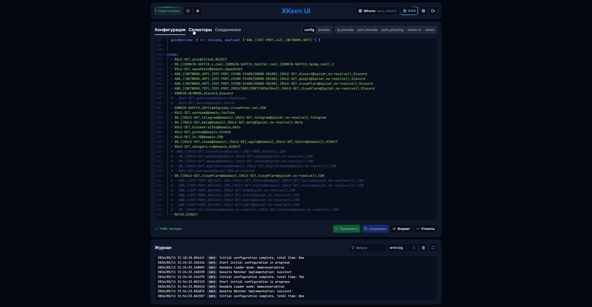

<div align="center">
  

<h1>XKeen UI</h1>

<p>Легковесная панель управления сервисом <b>XKeen</b> для роутеров Keenetic/Netzraze</p>
  


</div>
<br>  
  
## ✨ Особенности

- 🚀 Установка одной командой
- 📉 Низкое потребление ресурсов
- ⛔ Никаких зависимостей кроме XKeen
- ⚓️ Порт по умолчанию: 1000 (меняется в `/opt/etc/init.d/S99xkeen-ui`)
- 🎛️ Управление сервисом: `/opt/etc/init.d/S99xkeen-ui start|restart|stop|status`

&nbsp;

## ⚙️ Функционал

- 📊 Мониторинг и управление сервисом
- 📝 Редактирование конфигураций с валидацией и форматированием
- 📜 Просмотр логов с автообновлением и фильтрацией
- 🕒 Выбор часового пояса в логах
- 🔀 Переключение/установка/обновление ядер Xray и Mihomo
- 🔗 Генерация аутбаундов из ссылок (также доступно [отдельно по ссылке](https://zxc-rv.github.io/XKeen-UI/Outbound_Generator/))
- 🩻 Сканирование dat файлов
- ⚔️ Clash API реализация для Mihomo

&nbsp;

## 🔌 Совместимость

- 🌕 Полная: роутеры Keenetic/Netcraze на `ARM (aarch64)` чипах
- 🌗 Частичная*: роутеры Keenetic/Netcraze на `mips/mipsle` чипах
  
<sub> *На определенных mips/mipsle моделях может не работать некоторый функционал. При возникновении проблем с запуском создайте Issue с указанием названия модели, версии Keenetic OS и выводом команды `xkeen-ui -v` </sub>
  
&nbsp;

## ⚡️ Быстрый старт (установка/обновление/удаление)

### Cтабильная/Latest версия

```SH
curl https://raw.githubusercontent.com/zxc-rv/XKeen-UI/main/setup.sh | sh
```

### Бета/Pre-release версия

```SH
curl https://raw.githubusercontent.com/zxc-rv/XKeen-UI/main/setup.sh | sh -s -- beta
```

<br>

## 🌐 Доступ извне

Панель разработана для работы в локальной сети. В случае необходимости использовать панель за пределами локальной сети рекомендуется использовать VPN протоколы, такие как SSTP или Wireguard.
Также поддерживается работа с KeenDNS, для этого нужно в веб-конфигураторе создать саб-домен с протоколом HTTP и портом панели. Обязательно используйте авторизацию и другие меры безопасности!
> [!CAUTION]
> Открытие доступа к панели из интернета без должных мер безопасности может привести к взлому роутера или утечке данных.
> За данные последствия автор проекта ответственность не несет.
<br>
  
## 🪙 Понравился проект? Поддержи разработку

- [**Cloudtips**](https://pay.cloudtips.ru/p/24b4c4b6)

- Банковская карта: `2204 3203 4161 6409`
  
&nbsp;

## 🙏 Благодарности

- [**Skrill0/XKeen**](https://github.com/Skrill0/XKeen)  
- [**jameszeroX/XKeen**](https://github.com/jameszeroX/XKeen)  
- [**Anonym-tsk/nfqws-keenetic**](https://github.com/Anonym-tsk/nfqws-keenetic)
